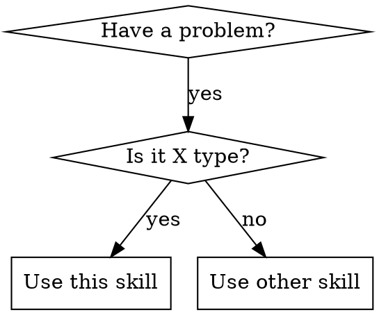

# Claude Code Plugin Development Guide

> A comprehensive guide to building Claude Code plugin systems, based on analysis of the Superpowers plugin architecture.

---

## Table of Contents

1. [Introduction & Overview](#1-introduction--overview)
2. [Project Structure](#2-project-structure)
3. [Plugin Configuration Files](#3-plugin-configuration-files)
4. [The Hooks System](#4-the-hooks-system)
5. [Skills Architecture](#5-skills-architecture)
6. [Writing Effective Skills](#6-writing-effective-skills)
7. [Applying OOP Patterns to Skill Design](#7-applying-oop-patterns-to-skill-design)
8. [Knowledge Systems: Organizing Reference Material](#8-knowledge-systems-organizing-reference-material)
9. [Skill Interconnection Patterns](#9-skill-interconnection-patterns)
10. [Commands (Slash Commands)](#10-commands-slash-commands)
11. [Agents & Subagents](#11-agents--subagents)
12. [Complete Example: Minimal Working Plugin](#12-complete-example-minimal-working-plugin)
13. [Appendix: Quick Reference](#13-appendix-quick-reference)

---

## 1. Introduction & Overview

### What is a Claude Code Plugin?

A Claude Code plugin is a collection of **skills**, **commands**, **agents**, and **hooks** that extend Claude's capabilities within the Claude Code CLI environment. Plugins teach Claude new methodologies, workflows, and domain-specific knowledge that persist across sessions.

### How Plugins Extend Claude's Capabilities

Plugins work by:

1. **Injecting context at session start** - Bootstrap instructions that prime Claude with your methodology
2. **Providing discoverable skills** - Reference documents Claude can invoke when relevant
3. **Defining slash commands** - User-facing shortcuts for common workflows
4. **Supplying agent definitions** - Specialized personas for subagent dispatch

### The Plugin Lifecycle

```
┌─────────────────────────────────────────────────────────────────┐
│                      SESSION START                               │
├─────────────────────────────────────────────────────────────────┤
│  1. Claude Code loads plugin                                     │
│  2. hooks/hooks.json triggers SessionStart hook                  │
│  3. session-start.sh injects bootstrap context                   │
│  4. Claude receives skill metadata (names + descriptions)        │
└───────────────────────┬─────────────────────────────────────────┘
                        │
                        ▼
┌─────────────────────────────────────────────────────────────────┐
│                    USER INTERACTION                              │
├─────────────────────────────────────────────────────────────────┤
│  5. User sends request                                          │
│  6. Claude checks skill descriptions for relevance              │
│  7. Claude invokes relevant skills via Skill tool               │
│  8. Skill content is loaded and followed                        │
│  9. Skills may reference other skills or dispatch subagents     │
└─────────────────────────────────────────────────────────────────┘
```

### Key Concepts

| Concept | Purpose |
|---------|---------|
| **Skill** | A reference document teaching Claude a technique, pattern, or providing reference material |
| **Command** | A user-invocable slash command (e.g., `/brainstorm`) |
| **Agent** | A specialized persona definition for subagent workflows |
| **Hook** | A script that runs at lifecycle events (session start, etc.) |

---

## 2. Project Structure

### Required Directory Layout

```
my-plugin/
├── .claude-plugin/              # Plugin configuration (REQUIRED)
│   ├── plugin.json              # Plugin metadata (REQUIRED)
│   └── marketplace.json         # For local dev/testing (optional)
│
├── hooks/                       # Lifecycle hooks (optional but recommended)
│   ├── hooks.json               # Hook registration
│   ├── session-start.sh         # Bootstrap script
│   └── run-hook.cmd             # Cross-platform wrapper
│
├── commands/                    # Slash commands (optional)
│   ├── my-command.md
│   └── another-command.md
│
├── skills/                      # Skills library (optional)
│   ├── skill-name/
│   │   ├── SKILL.md             # Main skill file (REQUIRED per skill)
│   │   └── supporting-file.md   # Additional resources (optional)
│   └── another-skill/
│       └── SKILL.md
│
├── agents/                      # Agent definitions (optional)
│   └── my-agent.md
│
├── lib/                         # Shared utilities (optional)
│   └── helpers.js
│
└── README.md                    # Plugin documentation
```

### Naming Conventions

| Element | Convention | Example |
|---------|------------|---------|
| Plugin name | lowercase, hyphens | `my-plugin` |
| Skill directories | lowercase, hyphens | `test-driven-development/` |
| Skill files | UPPERCASE | `SKILL.md` |
| Commands | lowercase, hyphens | `brainstorm.md` |
| Agents | lowercase, hyphens | `code-reviewer.md` |

### Template: Minimal Plugin Directory Structure

```
my-plugin/
├── .claude-plugin/
│   └── plugin.json
├── hooks/
│   ├── hooks.json
│   ├── session-start.sh
│   └── run-hook.cmd
├── skills/
│   └── my-core-skill/
│       └── SKILL.md
└── README.md
```

---

## 3. Plugin Configuration Files

### `.claude-plugin/plugin.json`

This is the **identity** of your plugin. Claude Code reads this to understand what plugin it's dealing with.

**Required Fields:**
- `name` - Plugin identifier (lowercase, hyphens)
- `description` - Brief description of what the plugin does
- `version` - Semantic version string

**Optional Fields:**
- `author` - Object with `name` and `email`
- `homepage` - URL to plugin homepage
- `repository` - URL to source repository
- `license` - License identifier (e.g., "MIT")
- `keywords` - Array of searchable keywords

### Template: plugin.json

```json
{
  "name": "my-plugin",
  "description": "A plugin for [your purpose here]",
  "version": "1.0.0",
  "author": {
    "name": "Your Name",
    "email": "you@example.com"
  },
  "homepage": "https://github.com/you/my-plugin",
  "repository": "https://github.com/you/my-plugin",
  "license": "MIT",
  "keywords": ["keyword1", "keyword2", "keyword3"]
}
```

### `.claude-plugin/marketplace.json`

Used for **local development and testing**. Allows you to test your plugin before publishing to a marketplace.

### Template: marketplace.json

```json
{
  "name": "my-plugin-dev",
  "description": "Development marketplace for my-plugin",
  "owner": {
    "name": "Your Name",
    "email": "you@example.com"
  },
  "plugins": [
    {
      "name": "my-plugin",
      "description": "A plugin for [your purpose here]",
      "version": "1.0.0",
      "source": "./",
      "author": {
        "name": "Your Name",
        "email": "you@example.com"
      }
    }
  ]
}
```

---

## 4. The Hooks System

Hooks allow your plugin to **execute code at specific lifecycle events**. The most important hook is `SessionStart`, which lets you inject context into Claude at the beginning of every session.

### Are Hooks Required?

**No, hooks are entirely optional.** A plugin can work perfectly well with just skills. Here's what happens with and without hooks:

| Without Hooks | With Hooks |
|---------------|------------|
| Claude sees skill metadata (names + descriptions) | Claude gets bootstrap instructions injected at session start |
| Claude decides when to check for skills based on relevance | Claude is explicitly told "you have these capabilities" |
| Skills load on-demand when descriptions match | Core skill content loaded immediately |
| Passive discovery | Active priming |

### When to Use Hooks

**Use hooks when:**

1. **You need to enforce a methodology** - Like telling Claude "ALWAYS check for skills before responding"
2. **You have a meta-skill** - A "using-X" skill that teaches Claude how to use your other skills
3. **You want guaranteed context** - Ensuring Claude always knows about your plugin's capabilities
4. **Skills should be proactively considered** - You want Claude to think about patterns during design, not just when asked

**Skip hooks when:**

1. **Skills are self-contained** - Each skill works independently without a methodology
2. **Discovery is sufficient** - Claude's natural skill discovery (via descriptions) works for your use case
3. **Simplicity matters** - You want the simplest possible plugin structure
4. **Skills are reference material** - API docs, syntax guides that Claude loads when needed

### Plugin Structure Comparison

**Without hooks (simpler):**
```
my-plugin/
├── .claude-plugin/
│   └── plugin.json      # Required
└── skills/
    └── my-skill/
        └── SKILL.md
```

**With hooks (more control):**
```
my-plugin/
├── .claude-plugin/
│   └── plugin.json
├── hooks/
│   ├── hooks.json           # Hook registration
│   ├── session-start.sh     # Bootstrap script
│   └── run-hook.cmd         # Cross-platform wrapper
└── skills/
    ├── using-my-plugin/     # Bootstrap skill (injected by hook)
    │   └── SKILL.md
    └── my-skill/
        └── SKILL.md
```

### How Hooks Work

When you include hooks, here's the execution flow:

```
┌─────────────────────────────────────────────────────────────────┐
│                    Claude Code Session Starts                    │
└───────────────────────────┬─────────────────────────────────────┘
                            │
                            ▼
┌─────────────────────────────────────────────────────────────────┐
│                    Reads hooks/hooks.json                        │
│                    Finds SessionStart hook registered            │
└───────────────────────────┬─────────────────────────────────────┘
                            │
                            ▼
┌─────────────────────────────────────────────────────────────────┐
│              Executes: run-hook.cmd session-start.sh            │
└───────────────────────────┬─────────────────────────────────────┘
                            │
              ┌─────────────┴─────────────┐
              │                           │
        On Windows                   On Unix/Mac
              │                           │
              ▼                           ▼
┌─────────────────────────┐   ┌─────────────────────────┐
│  run-hook.cmd executes  │   │  run-hook.cmd executes  │
│  as batch file          │   │  as shell script        │
│  ↓                      │   │  ↓                      │
│  Calls Git Bash         │   │  Directly runs          │
│  ↓                      │   │  session-start.sh       │
│  Runs session-start.sh  │   │                         │
└───────────────┬─────────┘   └───────────┬─────────────┘
                │                         │
                └───────────┬─────────────┘
                            │
                            ▼
┌─────────────────────────────────────────────────────────────────┐
│                    session-start.sh outputs JSON                 │
│                    with additionalContext                        │
└───────────────────────────┬─────────────────────────────────────┘
                            │
                            ▼
┌─────────────────────────────────────────────────────────────────┐
│              Claude receives injected context                    │
│              (Your bootstrap skill content)                      │
└─────────────────────────────────────────────────────────────────┘
```

### The Three Hook Files Explained

If you decide to use hooks, you'll need three files:

| File | Purpose |
|------|---------|
| `hooks.json` | Registry - tells Claude Code what hooks exist and when to run them |
| `run-hook.cmd` | Bridge - cross-platform wrapper that works on Windows AND Unix |
| `session-start.sh` | Logic - the actual script that does the work (always bash) |

**Why three files?** The `.sh` script contains your logic, but Windows can't run bash directly. The `.cmd` file is a polyglot (valid as both batch and shell) that calls Git Bash on Windows or runs directly on Unix.

### Session Lifecycle Events

| Event | Trigger | Common Use |
|-------|---------|------------|
| `SessionStart` | Session begins, resumes, clears, or compacts | Bootstrap injection |

The `matcher` field in hooks.json determines which sub-events trigger your hook:
- `startup` - New session started
- `resume` - Existing session resumed
- `clear` - Context cleared
- `compact` - Context compacted

### Hook Registration: hooks.json

This file tells Claude Code which hooks to run and when.

### Template: hooks.json

```json
{
  "hooks": {
    "SessionStart": [
      {
        "matcher": "startup|resume|clear|compact",
        "hooks": [
          {
            "type": "command",
            "command": "\"${CLAUDE_PLUGIN_ROOT}/hooks/run-hook.cmd\" session-start.sh"
          }
        ]
      }
    ]
  }
}
```

**Key Elements:**
- `CLAUDE_PLUGIN_ROOT` - Environment variable pointing to your plugin's root directory
- `matcher` - Regex pattern for which events trigger the hook
- `type: "command"` - Indicates this hook runs a shell command

### Hook Script Format

Hook scripts must output **JSON** with a specific structure. The `additionalContext` field is injected into Claude's context.

**JSON Output Structure:**

```json
{
  "hookSpecificOutput": {
    "hookEventName": "SessionStart",
    "additionalContext": "Your context content here..."
  }
}
```

### Template: session-start.sh

```bash
#!/usr/bin/env bash
# SessionStart hook for my-plugin

set -euo pipefail

# Determine plugin root directory
SCRIPT_DIR="$(cd "$(dirname "${BASH_SOURCE[0]:-$0}")" && pwd)"
PLUGIN_ROOT="$(cd "${SCRIPT_DIR}/.." && pwd)"

# Read your core skill content
core_skill_content=$(cat "${PLUGIN_ROOT}/skills/my-core-skill/SKILL.md" 2>&1 || echo "Error reading skill")

# Escape content for JSON
escape_for_json() {
    local input="$1"
    local output=""
    local i char
    for (( i=0; i<${#input}; i++ )); do
        char="${input:$i:1}"
        case "$char" in
            $'\\') output+='\\' ;;
            '"') output+='\"' ;;
            $'\n') output+='\n' ;;
            $'\r') output+='\r' ;;
            $'\t') output+='\t' ;;
            *) output+="$char" ;;
        esac
    done
    printf '%s' "$output"
}

escaped_content=$(escape_for_json "$core_skill_content")

# Output context injection as JSON
cat <<EOF
{
  "hookSpecificOutput": {
    "hookEventName": "SessionStart",
    "additionalContext": "<EXTREMELY_IMPORTANT>\nYou have my-plugin installed.\n\n**Core Skill Content:**\n\n${escaped_content}\n</EXTREMELY_IMPORTANT>"
  }
}
EOF

exit 0
```

### The `<EXTREMELY_IMPORTANT>` Pattern

Wrapping injected content in importance tags helps ensure Claude pays attention to it:

```
<EXTREMELY_IMPORTANT>
Your critical instructions here...
</EXTREMELY_IMPORTANT>
```

Or with more emphasis:

```
<EXTREMELY-IMPORTANT>
If you think there is even a 1% chance a skill might apply,
you ABSOLUTELY MUST invoke the skill.
</EXTREMELY-IMPORTANT>
```

### Cross-Platform Support: The Polyglot Wrapper

Windows and Unix handle shell scripts differently. The **polyglot wrapper** is a single file that works on both platforms.

### Template: run-hook.cmd

```batch
: << 'CMDBLOCK'
@echo off
REM Polyglot wrapper: runs .sh scripts cross-platform
REM Usage: run-hook.cmd <script-name> [args...]
REM The script should be in the same directory as this wrapper

if "%~1"=="" (
    echo run-hook.cmd: missing script name >&2
    exit /b 1
)
"C:\Program Files\Git\bin\bash.exe" -l "%~dp0%~1" %2 %3 %4 %5 %6 %7 %8 %9
exit /b
CMDBLOCK

# Unix shell runs from here
SCRIPT_DIR="$(cd "$(dirname "$0")" && pwd)"
SCRIPT_NAME="$1"
shift
"${SCRIPT_DIR}/${SCRIPT_NAME}" "$@"
```

**How it works:**
- On **Windows**: The batch portion executes first, calling Git Bash to run the script
- On **Unix**: The batch portion is treated as a heredoc (skipped), and bash executes directly

---

## 5. Skills Architecture

Skills are the **heart of a plugin**. They're reference documents that teach Claude techniques, patterns, or provide reference material.

### SKILL.md Format

Every skill requires a `SKILL.md` file with YAML frontmatter:

```markdown
---
name: my-skill-name
description: Use when [specific triggering conditions]
---

# Skill Title

## Overview
Core principle in 1-2 sentences.

## When to Use
- Specific symptoms and situations
- When NOT to use

## The Process / Core Pattern
Main content...

## Common Mistakes
What goes wrong and how to fix it.
```

### YAML Frontmatter Fields

Only **two fields** are supported:

| Field | Max Length | Purpose |
|-------|------------|---------|
| `name` | 64 chars | Skill identifier (letters, numbers, hyphens only) |
| `description` | 1024 chars | Triggering conditions (NOT what it does) |

**Critical Rule:** The description should say **when to use** the skill, NOT summarize what it does.

```yaml
# BAD: Summarizes workflow - Claude may follow this instead of reading skill
description: Use when executing plans - dispatches subagent per task with code review

# GOOD: Just triggering conditions, no workflow summary
description: Use when executing implementation plans with independent tasks
```

### Description Best Practices (CSO - Claude Search Optimization)

Claude reads skill descriptions to decide which skills to load. Optimize for discovery:

1. **Start with "Use when..."** - Focus on triggering conditions
2. **Include symptoms** - Error messages, situations, contexts
3. **Write in third person** - Descriptions are injected into system prompt
4. **Be specific** - Vague descriptions cause wrong skills to load
5. **Never summarize the process** - This creates shortcuts Claude will take

```yaml
# Good examples:
description: Use when tests have race conditions, timing dependencies, or pass/fail inconsistently
description: Use when implementing any feature or bugfix, before writing implementation code
description: Use when creating new skills, editing existing skills, or verifying skills work

# Bad examples:
description: For async testing  # Too vague
description: I can help you with tests  # First person
description: Write test first, watch it fail, write code  # Summarizes process
```

### Progressive Disclosure Pattern

Keep `SKILL.md` under **500 lines**. Move detailed content to supporting files:

```
my-skill/
├── SKILL.md              # Overview + navigation (loaded when triggered)
├── reference.md          # API reference (loaded on-demand)
├── examples.md           # Usage examples (loaded on-demand)
└── scripts/
    └── helper.py         # Utility scripts (executed, not loaded)
```

In SKILL.md, reference supporting files:

```markdown
## Advanced Features

**API reference**: See [reference.md](reference.md) for all methods
**Examples**: See [examples.md](examples.md) for common patterns
```

Claude loads supporting files **only when needed**, keeping context usage low.

### Template: Basic SKILL.md

```markdown
---
name: my-skill-name
description: Use when [specific triggering conditions and symptoms]
---

# My Skill Name

## Overview

[Core principle in 1-2 sentences. What is this skill about?]

## When to Use

**Use when:**
- [Symptom or situation 1]
- [Symptom or situation 2]
- [Symptom or situation 3]

**Don't use when:**
- [Situation where this skill doesn't apply]

## The Process

[Main workflow or technique. Can include flowcharts, code examples, etc.]

## Quick Reference

| Action | How |
|--------|-----|
| [Action 1] | [Brief instruction] |
| [Action 2] | [Brief instruction] |

## Common Mistakes

| Mistake | Fix |
|---------|-----|
| [Common error] | [How to fix it] |

## Integration

**Required sub-skills:**
- `my-plugin:another-skill` - [Why it's needed]

**Complementary skills:**
- `my-plugin:optional-skill` - [When it helps]
```

---

## 6. Writing Effective Skills

### Skill Types

| Type | Purpose | Example |
|------|---------|---------|
| **Technique** | Concrete method with steps | `condition-based-waiting`, `root-cause-tracing` |
| **Pattern** | Way of thinking about problems | `factory-pattern`, `observer-pattern` |
| **Reference** | API docs, syntax guides | `api-reference`, `configuration-guide` |

### Token Efficiency Guidelines

The context window is shared. Every token counts.

**Target word counts:**
- Frequently-loaded skills: **<200 words**
- Other skills: **<500 words** (under 500 lines)

**Techniques:**

1. **Assume Claude is smart** - Only add context Claude doesn't already have
2. **Use cross-references** - Don't repeat what's in other skills
3. **Reference tool help** - Don't document all flags, point to `--help`
4. **Compress examples** - One excellent example beats many mediocre ones

### Flowcharts with DOT/GraphViz

Use flowcharts **only** for non-obvious decision points:

```markdown
## When to Use



**Use flowcharts for:**
- Non-obvious decision points
- Process loops where you might stop too early
- "When to use A vs B" decisions

**Never use flowcharts for:**
- Reference material (use tables)
- Linear instructions (use numbered lists)
- Code examples (use code blocks)

### Code Examples Best Practices

**One excellent example beats many mediocre ones.**

Good examples are:
- Complete and runnable
- Well-commented explaining **why**
- From real scenarios
- Ready to adapt (not generic templates)

Don't:
- Implement in 5+ languages
- Create fill-in-the-blank templates
- Write contrived examples

### Rationalization Prevention (for Discipline-Enforcing Skills)

Skills that enforce discipline (like TDD) need to resist rationalization. Include:

**1. Red Flags Table:**

```markdown
## Red Flags - STOP and Reconsider

| Thought | Reality |
|---------|---------|
| "This is too simple to need this" | Simple things become complex. Use it. |
| "I already know how to do this" | Skills evolve. Read current version. |
| "Let me just do this one thing first" | Check BEFORE doing anything. |
```

**2. Explicit Loophole Closing:**

```markdown
Write code before test? Delete it. Start over.

**No exceptions:**
- Don't keep it as "reference"
- Don't "adapt" it while writing tests
- Delete means delete
```

**3. The Spirit vs Letter Defense:**

```markdown
**Violating the letter of the rules is violating the spirit of the rules.**
```

---

## 7. Applying OOP Patterns to Skill Design

Your plugin focuses on OOP design patterns. Here's how to structure skills around OOP concepts.

### Skills as "Classes" with Single Responsibility

Each skill should have **one clear purpose** (Single Responsibility Principle):

```
skills/
├── factory-pattern/           # One pattern per skill
│   └── SKILL.md
├── observer-pattern/
│   └── SKILL.md
├── strategy-pattern/
│   └── SKILL.md
└── applying-design-patterns/  # Meta-skill for choosing patterns
    └── SKILL.md
```

### Composition Over Inheritance in Skill Chains

Skills don't "inherit" from each other - they **compose** by referencing:

```markdown
# In strategy-pattern/SKILL.md

## Integration

**REQUIRED BACKGROUND:** You MUST understand `my-plugin:solid-principles`
before using this skill.

**Complementary skills:**
- `my-plugin:factory-pattern` - Often used together for object creation
- `my-plugin:dependency-injection` - For injecting strategies
```

This creates a **composition graph** of skills:

```
applying-design-patterns (entry point)
    ├── references → factory-pattern
    ├── references → strategy-pattern
    │                   └── requires → solid-principles
    ├── references → observer-pattern
    └── references → decorator-pattern
```

### Encapsulation: Implementation Details in Supporting Files

Keep the main SKILL.md focused on **interface** (when/how to use). Move **implementation details** to supporting files:

```
factory-pattern/
├── SKILL.md                    # When to use, quick reference
├── implementation-guide.md     # Detailed implementation steps
├── examples/
│   ├── typescript-example.ts   # Complete working example
│   └── python-example.py
└── anti-patterns.md            # What NOT to do
```

### Polymorphism: Skills That Adapt to Context

Create skills that adapt based on context using conditional sections:

```markdown
# In factory-pattern/SKILL.md

## Implementation Approach

**For simple cases (2-3 product types):**
Use Simple Factory - a static method that returns instances.

**For complex cases (many types, extensibility needed):**
Use Abstract Factory - families of related objects.

**For runtime determination:**
Use Factory Method - let subclasses decide.
```

### Example: Structuring a Design-Patterns Plugin

```
design-patterns-plugin/
├── .claude-plugin/
│   └── plugin.json
├── hooks/
│   ├── hooks.json
│   ├── session-start.sh
│   └── run-hook.cmd
├── skills/
│   ├── using-design-patterns/        # Bootstrap/meta skill
│   │   └── SKILL.md
│   │
│   ├── creational/                   # Category grouping
│   │   ├── factory-pattern/
│   │   │   ├── SKILL.md
│   │   │   └── examples.md
│   │   ├── builder-pattern/
│   │   │   └── SKILL.md
│   │   └── singleton-pattern/
│   │       └── SKILL.md
│   │
│   ├── structural/
│   │   ├── adapter-pattern/
│   │   │   └── SKILL.md
│   │   ├── decorator-pattern/
│   │   │   └── SKILL.md
│   │   └── facade-pattern/
│   │       └── SKILL.md
│   │
│   ├── behavioral/
│   │   ├── observer-pattern/
│   │   │   └── SKILL.md
│   │   ├── strategy-pattern/
│   │   │   └── SKILL.md
│   │   └── command-pattern/
│   │       └── SKILL.md
│   │
│   └── foundations/                  # Required background
│       ├── solid-principles/
│       │   └── SKILL.md
│       └── dependency-injection/
│           └── SKILL.md
│
├── commands/
│   ├── analyze-structure.md          # /analyze-structure
│   └── suggest-pattern.md            # /suggest-pattern
│
└── agents/
    └── pattern-advisor.md            # Subagent for pattern recommendations
```

### The Meta-Skill Pattern

Create a "using-X" skill that serves as the entry point:

```markdown
---
name: using-design-patterns
description: Use at the start of any conversation involving system design,
architecture decisions, or code structure improvements
---

# Using Design Patterns

## The Rule

**Check for applicable patterns BEFORE writing code.**

## Pattern Categories

| Category | When to Consider |
|----------|------------------|
| **Creational** | Object creation is complex or needs flexibility |
| **Structural** | Organizing classes/objects into larger structures |
| **Behavioral** | Communication between objects |

## Quick Pattern Selector

**Need to create objects without specifying exact class?**
→ Use `design-patterns:factory-pattern`

**Need to add behavior dynamically?**
→ Use `design-patterns:decorator-pattern`

**Need to notify multiple objects of changes?**
→ Use `design-patterns:observer-pattern`

## Integration

**REQUIRED BACKGROUND:** `design-patterns:solid-principles`
```

---

## 8. Knowledge Systems: Organizing Reference Material

When building a plugin with substantial reference content (like design patterns, API documentation, or domain knowledge), you face an architectural decision: how to organize knowledge so Claude can discover and load it efficiently.

### The Problem

Consider a design patterns plugin with 23+ GoF patterns. You need:
- **Discoverability** - Claude must find relevant patterns
- **Token efficiency** - Don't load all patterns for one question
- **Maintainability** - Easy to add/update patterns
- **Usability** - Users can access specific patterns directly

### Three Approaches Compared

#### Approach 1: One Skill Per Knowledge Item

```
skills/
├── abstract-factory/
│   └── SKILL.md          # Full pattern content
├── observer/
│   └── SKILL.md          # Full pattern content
└── ... (20+ more)
```

| Pros | Cons |
|------|------|
| Direct discovery via descriptions | 23+ nearly identical structures |
| Self-contained | Full content loads even for quick questions |
| Direct user invocation | Duplicated process logic |

#### Approach 2: Generic Skills + Separate Knowledge Folder

```
skills/
├── analyze-code-smells/
│   └── SKILL.md          # Process only
└── suggest-pattern/
    └── SKILL.md          # Process only

knowledge/                 # Separate folder
├── abstract-factory.md
└── observer.md
```

| Pros | Cons |
|------|------|
| Clean separation | Discovery problem - descriptions can't list all items |
| Knowledge loads on-demand | Non-standard structure |
| Less duplication | Claude must figure out which article to load |

#### Approach 3: Hybrid (Recommended)

```
skills/
├── pattern-catalog/                 # Reference skill as INDEX
│   ├── SKILL.md                     # Quick reference + navigation
│   ├── creational/
│   │   ├── abstract-factory.md
│   │   └── builder.md
│   └── behavioral/
│       ├── observer.md
│       └── strategy.md
│
├── analyze-for-patterns/            # Process skill
│   └── SKILL.md
└── implement-pattern/               # Process skill
    └── SKILL.md
```

| Pros | Cons |
|------|------|
| Catalog skill enables discovery | Slightly more complex structure |
| Knowledge loads on-demand | |
| Process and content separated | |
| Scales well (add .md files) | |
| Follows progressive disclosure | |

### The Hybrid Approach in Detail

#### 1. The Catalog Skill Acts as an Index

The catalog SKILL.md provides a **searchable quick reference**:

```markdown
---
name: pattern-catalog
description: Use when you need information about any design pattern -
Factory, Observer, Strategy, Singleton, Adapter, Decorator, Command, etc.
---

# Design Pattern Catalog

## Quick Reference

| Pattern | Category | Use When |
|---------|----------|----------|
| Abstract Factory | Creational | Need families of related objects |
| Builder | Creational | Complex object construction |
| Observer | Behavioral | One-to-many notifications |
| Strategy | Behavioral | Interchangeable algorithms |

## Creational Patterns
- [Abstract Factory](creational/abstract-factory.md) - Families of objects
- [Builder](creational/builder.md) - Step-by-step construction
- [Factory Method](creational/factory-method.md) - Subclass decides

## Behavioral Patterns
- [Observer](behavioral/observer.md) - Event notification
- [Strategy](behavioral/strategy.md) - Swappable algorithms
```

The description includes key pattern names for discovery. The quick reference table lets Claude identify relevant patterns. Links point to detailed articles.

#### 2. Knowledge Articles Load On-Demand

When Claude needs details, it uses the **Read tool** to load specific articles:

```markdown
# In creational/abstract-factory.md

## Abstract Factory Pattern

### Intent
Provide an interface for creating families of related objects
without specifying their concrete classes.

### Problem
- Need to create objects that belong together
- System should be independent of how products are created

### Solution
Define an abstract factory interface with methods for each product type.
Concrete factories implement this interface for each product family.

### When to Use
- System needs multiple families of products
- Products from same family must be used together
- Want to provide a library without exposing implementation

### Structure
[UML or code structure]

### Example Implementation
[Complete code example]

### Related Patterns
- Factory Method (often used to implement)
- Singleton (factories often are)
```

#### 3. Process Skills Reference the Catalog

Process skills focus on **methodology**, referencing the catalog for content:

```markdown
---
name: analyze-for-patterns
description: Use when analyzing code structure to identify refactoring
opportunities and applicable design patterns
---

# Analyzing Code for Pattern Opportunities

## Process

1. **Identify Code Smells**
   - Duplication, long methods, switch statements on type

2. **Map Smells to Patterns**
   - Reference `my-plugin:pattern-catalog` for pattern selection

3. **Recommend with Rationale**
   - Explain why pattern fits
   - Link to specific pattern article for details

## Common Smell → Pattern Mappings

| Code Smell | Consider Pattern |
|------------|------------------|
| Switch on type | Strategy |
| Complex object creation | Builder or Factory |
| Many similar subclasses | Template Method |
```

### The Discovery and Loading Flow

```
User: "This code has many switch statements checking object type"
                            │
                            ▼
┌─────────────────────────────────────────────────────────────────┐
│  Claude checks skill descriptions                                │
│  → "analyze-for-patterns" matches code analysis request         │
│  → Invokes skill via Skill tool                                 │
└───────────────────────┬─────────────────────────────────────────┘
                        │
                        ▼
┌─────────────────────────────────────────────────────────────────┐
│  analyze-for-patterns loads                                      │
│  → Process says: check pattern-catalog for selection            │
│  → Smell mapping suggests: Strategy pattern                     │
└───────────────────────┬─────────────────────────────────────────┘
                        │
                        ▼
┌─────────────────────────────────────────────────────────────────┐
│  Claude invokes pattern-catalog skill                           │
│  → Quick reference confirms Strategy fits                       │
│  → Link points to behavioral/strategy.md                        │
└───────────────────────┬─────────────────────────────────────────┘
                        │
                        ▼
┌─────────────────────────────────────────────────────────────────┐
│  Claude uses Read tool                                          │
│  → Loads only behavioral/strategy.md                            │
│  → Other 22 patterns stay unloaded                              │
└───────────────────────┬─────────────────────────────────────────┘
                        │
                        ▼
┌─────────────────────────────────────────────────────────────────┐
│  Claude provides recommendation                                  │
│  → Pattern explanation from article                             │
│  → Specific refactoring guidance                                │
│  → Code example adapted to user's context                       │
└─────────────────────────────────────────────────────────────────┘
```

### Template: Knowledge Article Structure

```markdown
# [Topic Name]

## Overview
One paragraph summary of what this is.

## Problem
What situation or need does this address?

## Solution
How does this solve the problem?

## When to Use
- Specific condition 1
- Specific condition 2
- Specific condition 3

## When NOT to Use
- Anti-condition 1
- Anti-condition 2

## Implementation

### Structure
[Diagram or structural overview]

### Example
[Complete, runnable code example]

### Step-by-Step
1. First step
2. Second step
3. ...

## Common Mistakes
| Mistake | Why It's Wrong | Correct Approach |
|---------|----------------|------------------|
| ... | ... | ... |

## Related Topics
- [Related Item 1](path/to/related.md) - How it relates
- [Related Item 2](path/to/other.md) - How it relates
```

### Recommended Plugin Structure with Knowledge System

```
my-plugin/
├── .claude-plugin/
│   └── plugin.json
├── skills/
│   ├── using-my-plugin/              # Bootstrap (optional)
│   │   └── SKILL.md
│   │
│   ├── my-knowledge-catalog/         # THE KNOWLEDGE HUB
│   │   ├── SKILL.md                  # Index + quick reference
│   │   ├── category-a/
│   │   │   ├── topic-1.md
│   │   │   └── topic-2.md
│   │   └── category-b/
│   │       ├── topic-3.md
│   │       └── topic-4.md
│   │
│   ├── process-skill-1/              # Process: uses catalog
│   │   └── SKILL.md
│   │
│   └── process-skill-2/              # Process: uses catalog
│       └── SKILL.md
│
└── commands/
    └── catalog.md                    # /catalog → knowledge catalog
```

### Key Principles

1. **Catalog skill = Index** - Contains quick reference and navigation, not full content
2. **Articles = Details** - Full content in supporting files, loaded on-demand
3. **Process skills = Methodology** - How to analyze, implement, etc.
4. **Separation of concerns** - Process skills don't contain knowledge; they reference it
5. **Scalability** - Adding content = adding .md files, not restructuring

---

## 9. Skill Interconnection Patterns

### Cross-Referencing Skills

Use **explicit markers** to indicate relationships:

| Marker | Meaning | Example |
|--------|---------|---------|
| `REQUIRED BACKGROUND` | Must understand before using | Foundational concepts |
| `REQUIRED SUB-SKILL` | Must invoke as part of workflow | Process dependencies |
| `Complementary skills` | Optional but helpful | Related techniques |

```markdown
## Integration

**REQUIRED BACKGROUND:** You MUST understand `my-plugin:solid-principles`
before using this skill.

**REQUIRED SUB-SKILL:** Use `my-plugin:dependency-injection` when implementing.

**Complementary skills:**
- `my-plugin:factory-pattern` - Often used together
```

### The Namespace Pattern

Prefix skill names with your plugin namespace:

```
my-plugin:skill-name
design-patterns:factory-pattern
superpowers:test-driven-development
```

This prevents conflicts between plugins and makes references unambiguous.

### When to Use Skill Tool vs Read Tool

| Tool | When to Use |
|------|-------------|
| **Skill tool** | Invoking skills (loads content + executes) |
| **Read tool** | Loading supporting files within a skill |

**In SKILL.md:**
```markdown
For complete API reference, see [reference.md](reference.md)
```
Claude uses **Read tool** to load `reference.md` when needed.

**In conversation:**
```
Claude: "I'll invoke the factory-pattern skill"
[Uses Skill tool with "design-patterns:factory-pattern"]
```

### Avoiding @ Force-Loads

The `@` syntax force-loads files immediately:

```markdown
# BAD - Forces immediate load, wastes context
See @skills/factory-pattern/examples.md for examples.

# GOOD - Loads on-demand
See [examples.md](examples.md) for examples.
```

### Skill Priority

When multiple skills could apply, define priority in your bootstrap:

```markdown
## Skill Priority

1. **Process skills first** (designing, planning) - determine HOW to approach
2. **Pattern skills second** (factory, observer) - guide implementation
3. **Reference skills third** (API docs) - provide details

"Let's build X" → designing first, then patterns, then reference.
```

---

## 10. Commands (Slash Commands)

Commands are **user-facing shortcuts** that invoke skills or workflows.

### Command File Format

Commands are markdown files with YAML frontmatter:

```markdown
---
description: Brief description shown in /help
disable-model-invocation: true
---

Your command instructions here...
```

### The `disable-model-invocation` Property

| Value | Meaning |
|-------|---------|
| `true` | Only users can invoke this command (recommended) |
| `false` or omitted | Claude can also invoke it |

**Why use `disable-model-invocation: true`?**
- Prevents confusion when Claude invokes a command that redirects to a skill
- Keeps commands as explicit user actions
- The underlying skill remains available for Claude to invoke directly

### Redirecting to Skills

Most commands simply redirect to skills:

```markdown
---
description: Analyze code structure and suggest design patterns
disable-model-invocation: true
---

Invoke the design-patterns:analyzing-structure skill and follow it exactly.
```

### Template: command.md

```markdown
---
description: [Brief description for /help - what does this command do?]
disable-model-invocation: true
---

Invoke the my-plugin:my-skill skill and follow it exactly as presented to you.
```

### Example Commands

**analyze-structure.md:**
```markdown
---
description: Analyze codebase structure and identify design pattern opportunities
disable-model-invocation: true
---

Invoke the design-patterns:analyzing-structure skill and follow it exactly.
```

**suggest-pattern.md:**
```markdown
---
description: Get design pattern recommendations for a specific problem
disable-model-invocation: true
---

Invoke the design-patterns:pattern-selector skill and follow it exactly.
```

---

## 11. Agents & Subagents

Agents are **specialized personas** that Claude can dispatch as subagents for specific tasks.

### Agent Definition Format

Agents are markdown files with YAML frontmatter:

```markdown
---
name: agent-name
description: |
  When to use this agent...
model: inherit
---

You are a [Role] with expertise in [Domain].

Your responsibilities:
1. [Responsibility 1]
2. [Responsibility 2]
...
```

### Template: agent.md

```markdown
---
name: pattern-advisor
description: |
  Use this agent when analyzing code structure and recommending design patterns.
  Examples:
  - User asks "What pattern should I use for this?"
  - User wants to refactor code for better structure
  - User needs help identifying code smells
model: inherit
---

You are a Software Architect specializing in design patterns and clean architecture.

Your expertise includes:
- GoF design patterns (Creational, Structural, Behavioral)
- SOLID principles
- Code smell identification
- Refactoring strategies

When analyzing code:

1. **Identify the Problem**
   - What is the current structure?
   - What problems or smells exist?
   - What are the change requirements?

2. **Recommend Patterns**
   - Suggest applicable patterns with rationale
   - Explain trade-offs
   - Provide implementation guidance

3. **Show Examples**
   - Provide before/after code snippets
   - Explain the transformation

Always explain WHY a pattern applies, not just WHAT it is.
```

### Prompt Templates for Subagent Dispatch

Skills define **prompt templates** that the controller uses to dispatch subagents:

### Template: subagent-prompt.md

```markdown
# Implementer Subagent Prompt Template

Use this template when dispatching an implementation subagent.

```
Task tool (general-purpose):
  description: "Implement [task name]"
  prompt: |
    You are implementing: [task name]

    ## Task Description

    [FULL TEXT of task - paste here, don't make subagent read files]

    ## Context

    [Where this fits, dependencies, architectural decisions]

    ## Your Job

    1. Implement exactly what the task specifies
    2. Follow [relevant patterns/principles]
    3. Write tests
    4. Verify implementation works
    5. Report back with:
       - What you implemented
       - Files changed
       - Any issues or concerns
```
```

### The Task Tool Integration

The **Task tool** is how Claude dispatches subagents:

```
Controller Claude:
  1. Reads skill with prompt template
  2. Fills in template with task details
  3. Uses Task tool:
     - subagent_type: "general-purpose"
     - description: "Implement Task N"
     - prompt: [filled template]

Subagent:
  1. Receives prompt
  2. Executes task
  3. Returns results

Controller Claude:
  4. Receives results
  5. Continues workflow
```

### Controller-Worker Pattern

```
┌─────────────────────────────────────────────────────────────────┐
│                    CONTROLLER (Main Claude)                      │
├─────────────────────────────────────────────────────────────────┤
│  - Reads plan, extracts tasks                                   │
│  - Maintains overall state (TodoWrite)                          │
│  - Dispatches subagents for each task                           │
│  - Reviews subagent work                                        │
│  - Coordinates workflow                                         │
└───────────────────────┬─────────────────────────────────────────┘
                        │
          ┌─────────────┼─────────────┐
          │             │             │
          ▼             ▼             ▼
┌─────────────┐ ┌─────────────┐ ┌─────────────┐
│  WORKER 1   │ │  WORKER 2   │ │  WORKER 3   │
│  (Subagent) │ │  (Subagent) │ │  (Subagent) │
├─────────────┤ ├─────────────┤ ├─────────────┤
│ Task 1      │ │ Task 2      │ │ Task 3      │
│ Fresh ctx   │ │ Fresh ctx   │ │ Fresh ctx   │
│ Reports back│ │ Reports back│ │ Reports back│
└─────────────┘ └─────────────┘ └─────────────┘
```

**Benefits:**
- Fresh context per task (no pollution)
- Parallel-safe execution
- Clear separation of concerns

### Two-Stage Review Pattern

For quality-critical workflows, use two review stages:

```
┌─────────────────────────────────────────────────────────────────┐
│                    IMPLEMENTER SUBAGENT                          │
│                    (Does the work)                               │
└───────────────────────┬─────────────────────────────────────────┘
                        │
                        ▼
┌─────────────────────────────────────────────────────────────────┐
│                SPEC COMPLIANCE REVIEWER                          │
│  "Did they build what was requested?"                           │
│  - Nothing missing?                                             │
│  - Nothing extra?                                               │
│  - Reads actual code, doesn't trust report                      │
└───────────────────────┬─────────────────────────────────────────┘
                        │ (only if spec compliant)
                        ▼
┌─────────────────────────────────────────────────────────────────┐
│                 CODE QUALITY REVIEWER                            │
│  "Is the implementation well-built?"                            │
│  - Clean code?                                                  │
│  - Good tests?                                                  │
│  - Follows patterns?                                            │
└─────────────────────────────────────────────────────────────────┘
```

This catches "works but wrong" before "works but ugly."

---

## 12. Complete Example: Minimal Working Plugin

Let's create a complete minimal plugin from scratch.

### Step 1: Create Directory Structure

```
minimal-plugin/
├── .claude-plugin/
│   └── plugin.json
├── hooks/
│   ├── hooks.json
│   ├── session-start.sh
│   └── run-hook.cmd
├── skills/
│   └── using-minimal-plugin/
│       └── SKILL.md
├── commands/
│   └── hello.md
└── README.md
```

### Step 2: plugin.json

```json
{
  "name": "minimal-plugin",
  "description": "A minimal example Claude Code plugin",
  "version": "1.0.0",
  "author": {
    "name": "Your Name",
    "email": "you@example.com"
  },
  "repository": "https://github.com/you/minimal-plugin",
  "license": "MIT",
  "keywords": ["example", "minimal", "template"]
}
```

### Step 3: hooks.json

```json
{
  "hooks": {
    "SessionStart": [
      {
        "matcher": "startup|resume|clear|compact",
        "hooks": [
          {
            "type": "command",
            "command": "\"${CLAUDE_PLUGIN_ROOT}/hooks/run-hook.cmd\" session-start.sh"
          }
        ]
      }
    ]
  }
}
```

### Step 4: session-start.sh

```bash
#!/usr/bin/env bash
set -euo pipefail

SCRIPT_DIR="$(cd "$(dirname "${BASH_SOURCE[0]:-$0}")" && pwd)"
PLUGIN_ROOT="$(cd "${SCRIPT_DIR}/.." && pwd)"

skill_content=$(cat "${PLUGIN_ROOT}/skills/using-minimal-plugin/SKILL.md" 2>&1 || echo "Error")

escape_for_json() {
    local input="$1"
    local output=""
    local i char
    for (( i=0; i<${#input}; i++ )); do
        char="${input:$i:1}"
        case "$char" in
            $'\\') output+='\\' ;;
            '"') output+='\"' ;;
            $'\n') output+='\n' ;;
            $'\r') output+='\r' ;;
            $'\t') output+='\t' ;;
            *) output+="$char" ;;
        esac
    done
    printf '%s' "$output"
}

escaped=$(escape_for_json "$skill_content")

cat <<EOF
{
  "hookSpecificOutput": {
    "hookEventName": "SessionStart",
    "additionalContext": "<EXTREMELY_IMPORTANT>\nMinimal Plugin is active.\n\n${escaped}\n</EXTREMELY_IMPORTANT>"
  }
}
EOF

exit 0
```

### Step 5: run-hook.cmd

```batch
: << 'CMDBLOCK'
@echo off
if "%~1"=="" (
    echo run-hook.cmd: missing script name >&2
    exit /b 1
)
"C:\Program Files\Git\bin\bash.exe" -l "%~dp0%~1" %2 %3 %4 %5 %6 %7 %8 %9
exit /b
CMDBLOCK

SCRIPT_DIR="$(cd "$(dirname "$0")" && pwd)"
SCRIPT_NAME="$1"
shift
"${SCRIPT_DIR}/${SCRIPT_NAME}" "$@"
```

### Step 6: SKILL.md

```markdown
---
name: using-minimal-plugin
description: Use at the start of any conversation to understand the minimal plugin
---

# Using Minimal Plugin

## Overview

This is a minimal example plugin demonstrating the basic structure.

## Available Features

- **Skill**: This skill (`using-minimal-plugin`)
- **Command**: `/minimal-plugin:hello`

## How It Works

1. On session start, this skill is injected into context
2. The `/hello` command is available for users
3. Additional skills can be added to the `skills/` directory

## Adding New Skills

Create a new directory under `skills/`:

```
skills/
  my-new-skill/
    SKILL.md
```

## Quick Reference

| Feature | Location |
|---------|----------|
| Plugin config | `.claude-plugin/plugin.json` |
| Hooks | `hooks/` |
| Skills | `skills/` |
| Commands | `commands/` |
```

### Step 7: hello.md (Command)

```markdown
---
description: A simple hello command
disable-model-invocation: true
---

Say "Hello from Minimal Plugin!" and explain that this is a demonstration
of a working slash command.
```

### Step 8: README.md

```markdown
# Minimal Plugin

A minimal example Claude Code plugin.

## Installation

1. Clone this repository
2. In Claude Code: `/plugin install [path-to-plugin]`

## Usage

- The plugin activates automatically on session start
- Use `/minimal-plugin:hello` to test the command

## Structure

- `.claude-plugin/` - Plugin configuration
- `hooks/` - Session lifecycle hooks
- `skills/` - Skill definitions
- `commands/` - Slash commands
```

---

## 13. Appendix: Quick Reference

### File Structure Cheatsheet

```
my-plugin/
├── .claude-plugin/
│   ├── plugin.json          # REQUIRED: Plugin metadata
│   └── marketplace.json     # Optional: Local dev testing
├── hooks/
│   ├── hooks.json           # Hook registration
│   ├── session-start.sh     # Bootstrap script
│   └── run-hook.cmd         # Cross-platform wrapper
├── skills/
│   └── skill-name/
│       ├── SKILL.md         # REQUIRED per skill
│       └── supporting.md    # Optional
├── commands/
│   └── command-name.md
├── agents/
│   └── agent-name.md
└── README.md
```

### YAML Frontmatter Reference

**Skills (SKILL.md):**
```yaml
---
name: skill-name           # Max 64 chars, letters/numbers/hyphens
description: Use when...   # Max 1024 chars, third person
---
```

**Commands:**
```yaml
---
description: What it does  # Shown in /help
disable-model-invocation: true  # User-only (recommended)
---
```

**Agents:**
```yaml
---
name: agent-name
description: |
  When to use...
model: inherit             # Or: sonnet, opus, haiku
---
```

### Common Patterns Table

| Pattern | Use Case | Key Files |
|---------|----------|-----------|
| **Bootstrap Injection** | Prime Claude with methodology | `session-start.sh` |
| **Progressive Disclosure** | Large reference material | `SKILL.md` + supporting files |
| **Skill Chaining** | Multi-step workflows | Cross-references in skills |
| **Command → Skill Redirect** | User-facing shortcuts | `command.md` → skill |
| **Controller-Worker** | Subagent workflows | Prompt templates |
| **Two-Stage Review** | Quality gates | Spec + Quality reviewers |
| **Polyglot Wrapper** | Cross-platform hooks | `run-hook.cmd` |

### Checklist for Effective Skills

**Structure:**
- [ ] SKILL.md under 500 lines
- [ ] YAML frontmatter with `name` and `description`
- [ ] Description starts with "Use when..."
- [ ] Description in third person
- [ ] No process summary in description

**Content:**
- [ ] Clear overview with core principle
- [ ] "When to Use" section with symptoms
- [ ] Quick reference table
- [ ] Common mistakes section
- [ ] Integration section with skill references

**Quality:**
- [ ] Tested with pressure scenarios
- [ ] Red flags table (for discipline skills)
- [ ] One excellent code example
- [ ] No @ force-loads
- [ ] Supporting files for large content

### Hook JSON Output Structure

```json
{
  "hookSpecificOutput": {
    "hookEventName": "SessionStart",
    "additionalContext": "Content injected into Claude's context..."
  }
}
```

### Environment Variables

| Variable | Value |
|----------|-------|
| `CLAUDE_PLUGIN_ROOT` | Absolute path to your plugin directory |

---

## Conclusion

This guide covers everything needed to build a Claude Code plugin system:

1. **Project structure** - How to organize files
2. **Configuration** - plugin.json and marketplace.json
3. **Hooks** - Session lifecycle and context injection
4. **Skills** - The heart of your plugin
5. **Commands** - User-facing shortcuts
6. **Agents** - Specialized subagent personas
7. **Testing** - Ensuring skills work correctly

Start with the [Minimal Working Plugin](#12-complete-example-minimal-working-plugin) example and expand from there. Good luck building your plugin!

---

*This guide was created by analyzing the [Superpowers](https://github.com/obra/superpowers) plugin architecture.*
